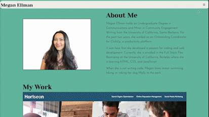

# Portfolio

## Technology Used

| Technology Used |                                              Resource URL                                              |
| --------------- | :----------------------------------------------------------------------------------------------------: |
| HTML            | [https://developer.mozilla.org/en-US/docs/Web/HTML](https://developer.mozilla.org/en-US/docs/Web/HTML) |
| CSS             |  [https://developer.mozilla.org/en-US/docs/Web/CSS](https://developer.mozilla.org/en-US/docs/Web/CSS)  |
| Git             |                              [https://git-scm.com/](https://git-scm.com)                               |
| Bootstrap       |            [bootstrap.com](https://getbootstrap.com/docs/5.3/getting-started/introduction/)            |

## Description

[Click here for deployed site](https://megellman.github.io/portfolio/)



I created a professional portfolio webpage. On this page is a description about me, examples of my work, and information on how to contact me. I created this webpage to show future employers my work and to practice media responsive layouts.

## Table of Contents

- [Portfolio](#portfolio)
  - [Technology Used](#technology-used)
  - [Description](#description)
  - [Table of Contents](#table-of-contents)
  - [Learning Points](#learning-points)
  - [Author Info](#author-info)
    - [Megan Ellman](#megan-ellman)
  - [Credits](#credits)
  - [License](#license)

## Learning Points

In doing this project, I learned how to create and customize the design of a scrollbar using CSS. This makes it much easier for users to interact with my webpage.

```
::-webkit-scrollbar {
    width: 20px;
}

::-webkit-scrollbar-track {
    background-color: #c4adaa;
}

::-webkit-scrollbar-thumb {
    background-color: #a89897;
}

::-webkit-scrollbar-thumb:hover {
    background-color: #928988;
}
```

```
<div class="carousel-item">
    <a href="https://megellman.github.io/css-snippet-cheat-sheet/" target="_blank">
        
    </a>
    <div class="carousel-caption d-none d-md-block">
        <h5>CSS Snippet Cheat Sheet</h5>
    </div>
</div>
```

## Author Info

### Megan Ellman

[LinkedIn](https://www.linkedin.com/in/megan-ellman/)

[GitHub](https://github.com/megellman)

## Credits

| Resource  |                                        Link                                        |
| --------- | :--------------------------------------------------------------------------------: |
| Scrollbar |  [w3schools.com](https://www.w3schools.com/howto/howto_css_custom_scrollbar.asp)   |
| Navbar    | [bootstrap.com](https://getbootstrap.com/docs/5.3/components/navbar/#how-it-works) |

## License

MIT License

Copyright (c) [2022] [Megan Ellman]

Permission is hereby granted, free of charge, to any person obtaining a copy
of this software and associated documentation files (the "Software"), to deal
in the Software without restriction, including without limitation the rights
to use, copy, modify, merge, publish, distribute, sublicense, and/or sell
copies of the Software, and to permit persons to whom the Software is
furnished to do so, subject to the following conditions:

The above copyright notice and this permission notice shall be included in all
copies or substantial portions of the Software.

THE SOFTWARE IS PROVIDED "AS IS", WITHOUT WARRANTY OF ANY KIND, EXPRESS OR
IMPLIED, INCLUDING BUT NOT LIMITED TO THE WARRANTIES OF MERCHANTABILITY,
FITNESS FOR A PARTICULAR PURPOSE AND NONINFRINGEMENT. IN NO EVENT SHALL THE
AUTHORS OR COPYRIGHT HOLDERS BE LIABLE FOR ANY CLAIM, DAMAGES OR OTHER
LIABILITY, WHETHER IN AN ACTION OF CONTRACT, TORT OR OTHERWISE, ARISING FROM,
OUT OF OR IN CONNECTION WITH THE SOFTWARE OR THE USE OR OTHER DEALINGS IN THE
SOFTWARE.
